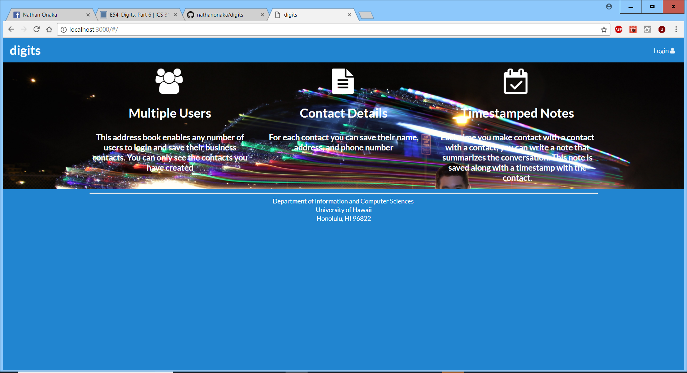
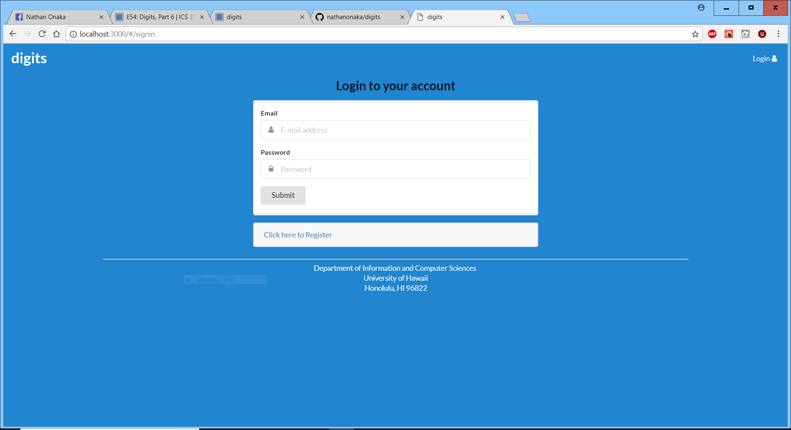
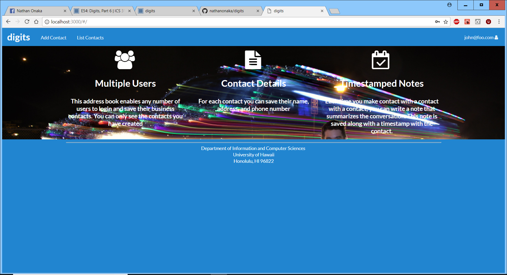
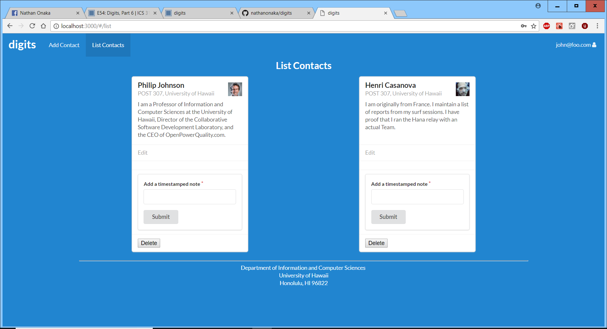
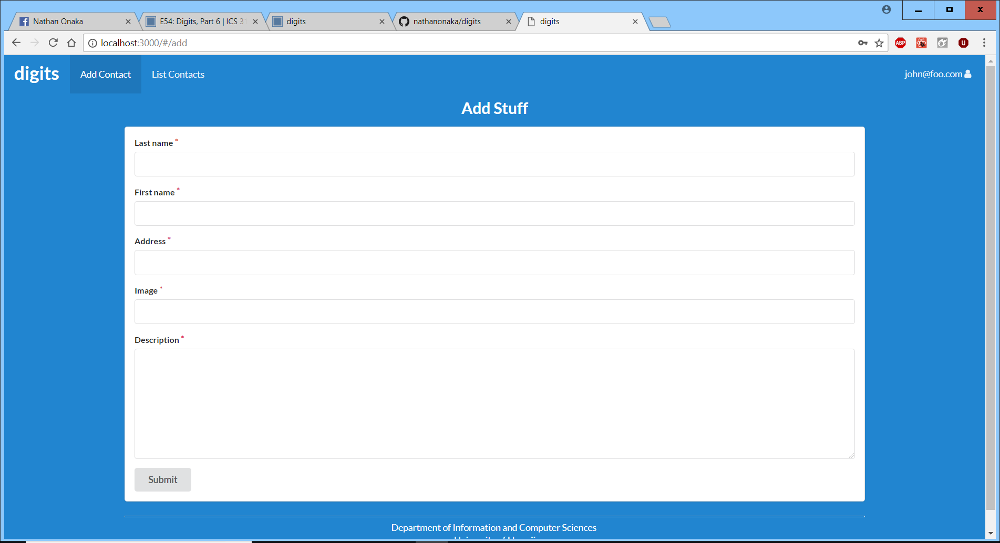
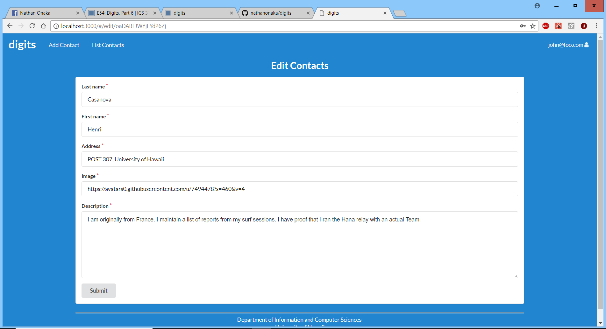
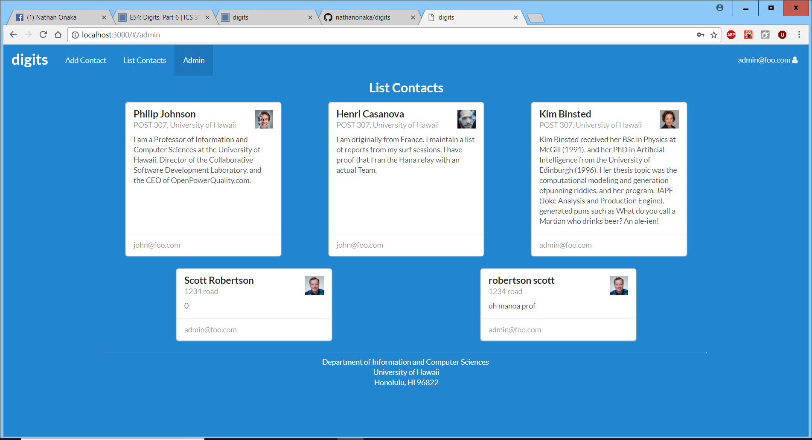

# Digits
Digits is an application designed to let users create accounts and keep track of contacts, they can edit and remove contacts, as well as add time-stamped notes for each contact.

## Installation
1. Install [Meteor](https://www.meteor.com/install)
2. Download [Digits](https://github.com/philipmjohnson/digits) template.  Digits is private so you will need to request access from the author.
3. Use command line and CD into the app directory
4. Run ```meteor npm install``` to install libraries
5. Start the application by running ```meteor npm run start```
6. Your application will appear at [http://localhost:3000](http://localhost:3000) It may take some time to run
7. Log in using the credentials found in [settings.development.json](https://github.com/ics-software-engineering/meteor-application-template-react/blob/master/config/settings.development.json) or register a new account

### Landing Page
This is the initial landing page


### Login or Register
At the top right there is a login button, here you can enter your credentials or make a new account


### User Home Page
The user home page looks similar to the landing page, but it contains new tabs at the top to add contacts, list contacts, and your current account name.


### List Contact
This will list all the current contacts associated with your account

You will notice options to edit the contact info, add a comment, or delete the contact

### Add Contact
Clicking add contact will take you to a page where you can fill in a new contact's information


### Edit Contact
If you choose to edit contact it will take you to a page similar to add contact, but you can now change the pre-existing info


### Admin Account
There is an admin account that allows you to see all contacts with their respected owners

